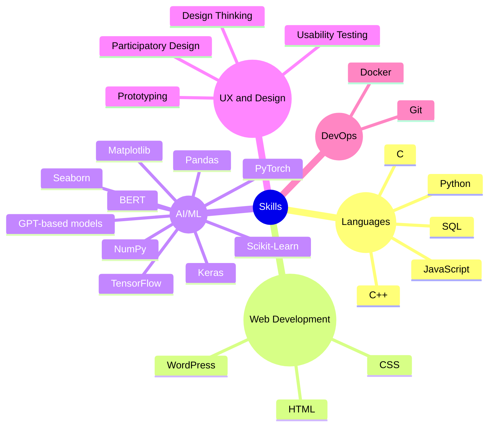

# Hi, I'm Pooriya Jamie 👋

I’m a passionate Computer Science researcher and developer dedicated to advancing AI, human-computer interaction, and data science. My work focuses on leveraging innovative computational methods to enhance digital interactions and empower diverse communities.

---

## 🚀 What I Do

- **Innovative Research & Development:**  
  I explore cutting-edge techniques in AI-assisted education and interactive digital experiences.
- **Project Leadership:**  
  Driving impactful projects such as AI-driven assessment systems, emotion-aware recommendation engines, and financial intelligence solutions.
- **Collaborative Innovation:**  
  Partnering with academic institutions and industry experts to transform ideas into real-world solutions.

---

## 💻 Technical Skills

---

## 🌟 Highlights

- **AI in Education:**  
  Leveraging ChatGPT and modern AI tools to design advanced teaching assistants and feedback systems.
- **Emotion-Aware Technologies:**  
  Researching and developing systems that integrate emotional intelligence into digital experiences.
- **Financial Intelligence:**  
  Applying machine learning techniques to enhance forecasting and data-driven insights in financial markets.

---

## 📫 Connect With Me

- **GitHub:** [pooriya-jamie](https://github.com/pooriya-jamie)
- **LinkedIn:** [pooriyajamie](https://www.linkedin.com/in/pooriyajamie/)
- **Google Scholar:** [Profile](https://scholar.google.com/citations?user=NolFxk8AAAAJ&hl=en)
- **Website:** [pooriya-jamie.github.io](https://pooriya-jamie.github.io/)

Feel free to reach out via email at [Pooriya.Jamie@gmail.com](mailto:Pooriya.Jamie@gmail.com).

---

Thanks for visiting my profile!

